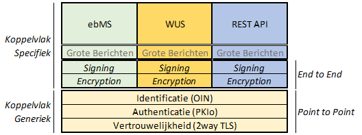

# Context voor ontwikkeling van het Digikoppeling REST API profiel 

*Dit profiel is in ontwikkeling*

Het Digikoppeling Rest API profiel is gericht op M2M (Machine-to--Machine) en G2G (Government-to-Government) interacties conform de algemene uitgangspunten van de Digkoppeling standaard en het toepassingsgebied van Digikoppeling op de PTLU (Pas toe of leg uit) lijst van het Forum Standaardisatie;

Opzet Digikoppeling:

## Toelichting bij de scope van het Digikoppeling REST API profiel

In de figuur wordt onderscheid gemaakt tussen open en gesloten diensten:
* Open Diensten: diensten zonder toegangsbeperking bv open data.
* Gesloten Diensten: diensten met toegangsbeperking bv persoonsgegevens en vertrouwelijke gegevens of diensten voor specifieke partijen.

Het Digikoppeling REST API profiel richt zich op M2M gegevensuitwisseling over een gesloten kanaal tussen overheidspartijen.
Buiten scope van het profiel zijn:
* REST API's voor open diensten van een overheidspartij.
* REST API's'voor gesloten diensten van een overheidspartij (direct) aan burgers of bedrijven. 

# Digikoppeling Restful API profiel

HTML versie [Digikoppeling Restful API Profiel](https://centrumvoorstandaarden.github.io/DigikoppelingRestfulApiProfiel/)

## Inleiding

- Historie

Vanuit het TO Digikoppeling zijn al langere tijd de ontwikkelingen rond Restful API's gevolgd. Binnen het Kennisplatform API zijn de REST-API Design Rules (REST ADR) ontwikkeld en de REST ADR standaard is ook opgenomen op de PTLU lijst van het Formum Standaardisatie. De REST ADR standaard is dan ook als basis genomen voor dit Digikoppeling REST API Profiel dat zich specifiek richt op G2G (Government-to-Government) interactie en M2M (Machine-to-Machine verkeer).

- Toepassingsgebied

Het toepassingsgebied is voor Digikoppeling:

*Digikoppeling moet worden toegepast op alle digitale gegevensuitwisseling met behulp van gestructureerde berichten die plaatsvindt met voorzieningen die onderdeel zijn van de GDI, waaronder de basisregistraties, of die sector-overstijgend is.*

*Geautomatiseerde gegevensuitwisseling tussen informatiesystemen op basis van NEN3610 is uitgesloten van het functioneel toepassingsgebied*.

Dit profiel is toe te passen bij het aanbieden van REST API's ten behoeve van het ontsluiten van overheidsinformatie en/of functionaliteit.

## DK API REST profiel

### Algemeen

Het DK REST-API profiel is gebaseed op de REST-API Design Rules standaard zoals ontwikkeld door het Kennisplatform API's en in beheer gebracht bij Logius Stelsels & Standaarden:
https://publicatie.centrumvoorstandaarden.nl/api/adr/

### Transport beveiliging
Zie https://logius.nl/sites/default/files/bestanden/website/Digikoppeling_Beveiligingsstandaarden_en_voorschriften_v1.3.pdf

### Identificatie Authenticatie
https://logius.nl/sites/default/files/public/bestanden/diensten/DigiKoppeling/Standaarden/Digikoppeling-Identificatie-en-Authenticatie.pdf

### Gebruik Service register

[Toelichting volgt]

### API Design Rules

#### Toelichting aanduidingen

 Voorschriften zijn aangeduid met Must, Should, Could en Won't waarvoor de volgende definities gelden: 

|**Cat** |**Voorschrift** | **Toelichting** |
| --- | --- |---|
|  M | MUST have |De Must have eisen moeten gerealiseerd worden. Hier kan niet van afgeweken worden.| 
|  S |SHOULD have| Implementatie conform voorschrift tenzij dit niet mogelijk is én er een workaround beschikbaar is die een vergelijkbaar resultaat mogelijk maakt.| 
| C | COULD have| Dit betreft eisen die gewenst zijn maar waar men vrij is een andere keuze te maken.|
| W | WON'T | Deze eisen worden in de context van dit profiel niet toegepast.|

(Indeling gebaseerd op https://tools.ietf.org/html/rfc2119)

#### Regels

 |**Categorie** |**Principe** |**Toelichting** |**Link** |
 |--- | --- |---|---|
 |MUST |3.1 API-01: Operations are Safe and/or Idempotent |  |[API-01: Adhere to HTTP safety and idempotency semantics for operations](https://logius-standaarden.github.io/API-Design-Rules/#api-01) |
 |MUST |3.2 API-02: Do not maintain state information at the server |  |[API-02: Do not maintain session state on the server](https://logius-standaarden.github.io/API-Design-Rules/#api-02) |
 |MUST |3.3 API-03: Only apply default HTTP operations |  |[API-03: Only apply standard HTTP methods](https://logius-standaarden.github.io/API-Design-Rules/#api-03) |
 |MUST |3.4 API-04: Define interfaces in Dutch unless there is an official English glossary |  |[API-04: Define interfaces in Dutch unless there is an official English glossary available](https://logius-standaarden.github.io/API-Design-Rules/#api-04) |
 |MUST |3.5 API-05: Use plural nouns to indicate resources |  |[API-05: Use nouns to name resources](https://logius-standaarden.github.io/API-Design-Rules/#api-05) |
 |MUST |3.6 API-06: Create relations of nested resources within the endpoint |  |[API-06: Use nested URIs for child resources](https://logius-standaarden.github.io/API-Design-Rules/#api-06) |
 |MUST |3.7 API-09: Implement custom representation if supported |  |[API-10: Model resource operations as a sub-resource or dedicated resource](https://logius-standaarden.github.io/API-Design-Rules/#api-10) |
 |MUST |3.8 API-10: Implement operations that do not fit the CRUD model as sub-resources |  |[API-10: Model resource operations as a sub-resource or dedicated resource](https://logius-standaarden.github.io/API-Design-Rules/#api-10) ||MUST |3.9 API-16: Use OAS 3.0 for documentation |  |[API-16: Use OpenAPI Specification for documentation](https://logius-standaarden.github.io/API-Design-Rules/#api-16) |
 |MUST |3.10 API-17: Publish documentation in Dutch unless there is existing documentation in English or there is an official English glossary available |  |[API-17: Publish documentation in Dutch unless there is existing documentation in English](https://logius-standaarden.github.io/API-Design-Rules/#api-17) |
 |MUST |3.11 API-18: Include a deprecation schedule when publishing API changes |  |[API-18: Include a deprecation schedule when publishing API changes](https://logius-standaarden.github.io/API-Design-Rules/#api-18) |
 |MUST |3.12 API-19: Allow for a maximum 1 year transition period to a new API version |  |[API-19: Schedule a fixed transition period for a new major API version](https://logius-standaarden.github.io/API-Design-Rules/#api-19) |
 |MUST |3.13 API-20: Include the major version number only in ihe URI |  |[API-20: Include the major version number in the URI](https://logius-standaarden.github.io/API-Design-Rules/#api-20) |
 |MUST |3.14 API-48: Leave off trailing slashes from API endpoints |  |[API-48: Leave off trailing slashes from URIs](https://logius-standaarden.github.io/API-Design-Rules/#api-48) |
 |MUST |3.15 API-51: Publish OAS at the base-URI in JSON-format | |[API-51: Publish OAS document at a standard location in JSON-format](https://logius-standaarden.github.io/API-Design-Rules/#api-51) 
 
## Afspraken API Design Rules extensies

| **Categorie** | **Principe** | **Extensie** | **Toelichting** | **Link** | 
| --- | --- | --- | --- | --- |
| MUST | 17.1 API-11: Encrypt connections using TLS following the latest NCSC guidelines | Security | | [17.1 API-11: Encrypt connections using TLS following the latest NCSC guidelines](https://geonovum.github.io/KP-APIs/API-strategie-extensies/#api-11-encrypt-connections-using-tls-following-the-latest-ncsc-guidelines) | 
| COULD | 17.2 API-12: Allow access to an API only if an API key is provided | Security Authorisation | | [17.2 API-12: Allow access to an API only if an API key is provided](https://docs.geostandaarden.nl/api/API-Strategie-ext/#api-12-allow-access-to-an-api-only-if-an-api-key-is-provided) | 
| MUST | 17.3 API-13: Accept tokens as HTTP headers only | Security Authorisation | | [17.3 API-13: Accept tokens as HTTP headers only](https://docs.geostandaarden.nl/api/API-Strategie-ext/#api-13-accept-tokens-as-http-headers-only) |
| COULD | 17.4 API-14: Use OAuth 2.0 for authorisation | Security Authorisation | | [17.4 API-14: Use OAuth 2.0 for authorisation](https://docs.geostandaarden.nl/api/API-Strategie-ext/#api-14-use-oauth-2-0-for-authorisation) | 
| MUST | 17.5 API-15: Use PKIoverheid certificates for access-restricted or purpose-limited API authentication | Security Authorisation | | [17.5 API-15: Use PKIoverheid certificates for access-restricted or purpose-limited API authentication](https://docs.geostandaarden.nl/api/API-Strategie-ext/#api-15-use-pkioverheid-certificates-for-access-restricted-or-purpose-limited-api-authentication) | 
| WON'T | 17.6 API-21: Inform users of a deprecated API actively | Deprecation | | [17.6 API-21: Inform users of a deprecated API actively](https://docs.geostandaarden.nl/api/API-Strategie-ext/#api-21-inform-users-of-a-deprecated-api-actively) | 
| COULD | 17.7 API-22: JSON first - APIs receive and send JSON | JSON  | | [17.7 API-22: JSON first - APIs receive and send JSON](https://docs.geostandaarden.nl/api/API-Strategie-ext/#api-22-json-first-apis-receive-and-send-json) |
| COULD | 17.8 API-23: APIs may provide a JSON Schema | JSON | | [17.8 API-23: APIs may provide a JSON Schema](https://docs.geostandaarden.nl/api/API-Strategie-ext/#api-23-apis-may-provide-a-json-schema) | 
| COULD | 17.9 API-24: Support content negotiation | JSON  | | [17.9 API-24: Support content negotiation](https://docs.geostandaarden.nl/api/API-Strategie-ext/#api-24-support-content-negotiation) | 
| COULD | 17.10 API-25: Check the Content-Type header settings | JSON | | [17.10 API-25: Check the Content-Type header settings](https://docs.geostandaarden.nl/api/API-Strategie-ext/#api-25-check-the-content-type-header-settings) |
| COULD | 17.11 API-26: Define field names in in camelCase | JSON | | [17.11 API-26: Define field names in in camelCase](https://docs.geostandaarden.nl/api/API-Strategie-ext/#api-26-define-field-names-in-in-camelcase) | | COULD | 17.12 API-27: Disable pretty print | JSON  | | [17.12 API-27: Disable pretty print](https://docs.geostandaarden.nl/api/API-Strategie-ext/#api-27-disable-pretty-print) |
| COULD | 17.13 API-28: Send a JSON-response without enclosing envelope | JSON  | | [17.13 API-28: Send a JSON-response without enclosing envelope](https://docs.geostandaarden.nl/api/API-Strategie-ext/#api-28-send-a-json-response-without-enclosing-envelope) |
| COULD | 17.14 API-29: Support JSON-encoded POST, PUT, and PATCH payloads | JSON  | | [17.14 API-29: Support JSON-encoded POST, PUT, and PATCH payloads](https://docs.geostandaarden.nl/api/API-Strategie-ext/#api-29-support-json-encoded-post-put-and-patch-payloads) |
| COULD | 17.15 API-30: Use query parameters corresponding to the queryable fields | Filtering | | [17.15 API-30: Use query parameters corresponding to the queryable fields](https://docs.geostandaarden.nl/api/API-Strategie-ext/#api-30-use-query-parameters-corresponding-to-the-queryable-fields) |
| COULD | 17.16 API-31: Use the query parameter sorteer to sort | Filtering | | [17.16 API-31: Use the query parameter sorteer to sort](https://docs.geostandaarden.nl/api/API-Strategie-ext/#api-31-use-the-query-parameter-sorteer-to-sort) | 
| COULD | 17.17 API-32: Use the query parameter zoek for full-text search | Search  | | [17.17 API-32: Use the query parameter zoek for full-text search](https://docs.geostandaarden.nl/api/API-Strategie-ext/#api-32-use-the-query-parameter-zoek-for-full-text-search) | 
| COULD | 17.18 API-33: Support both * and ? wildcard characters for full-text search APIs | Search  | | [17.18 API-33: Support both * and ? wildcard characters for full-text search APIs](https://docs.geostandaarden.nl/api/API-Strategie-ext/#api-33-support-both-and-wildcard-characters-for-full-text-search-apis) | 
| COULD | 17.19 API-34: Support GeoJSON for GEO APIs | GEO  | | [17.19 API-34: Support GeoJSON for GEO APIs](https://docs.geostandaarden.nl/api/API-Strategie-ext/#api-34-support-geojson-for-geo-apis) |
| COULD | 17.20 API-35: Include GeoJSON as part of the embedded resource in the JSON response | GEO  | | [17.20 API-35: Include GeoJSON as part of the embedded resource in the JSON response](https://docs.geostandaarden.nl/api/API-Strategie-ext/#api-35-include-geojson-as-part-of-the-embedded-resource-in-the-json-response) |
| COULD | 17.21 API-36: Provide a POST endpoint for GEO queries | GEO  | | [17.21 API-36: Provide a POST endpoint for GEO queries](https://docs.geostandaarden.nl/api/API-Strategie-ext/#api-36-provide-a-post-endpoint-for-geo-queries) |
| COULD | 17.22 API-37: Support mixed queries at POST endpoints | GEO  | | [17.22 API-37: Support mixed queries at POST endpoints](https://docs.geostandaarden.nl/api/API-Strategie-ext/#api-37-support-mixed-queries-at-post-endpoints) | 
| COULD | 17.23 API-38: Put results of a global spatial query in the relevant geometric context | GEO  | | [17.23 API-38: Put results of a global spatial query in the relevant geometric context](https://docs.geostandaarden.nl/api/API-Strategie-ext/#api-38-put-results-of-a-global-spatial-query-in-the-relevant-geometric-context) |
| COULD | 17.24 API-39: Use ETRS89 as the preferred coordinate reference system (CRS) | GEO  | | [17.24 API-39: Use ETRS89 as the preferred coordinate reference system (CRS)](https://docs.geostandaarden.nl/api/API-Strategie-ext/#api-39-use-etrs89-as-the-preferred-coordinate-reference-system-crs) |
| COULD | 17.25 API-40: Pass the coordinate reference system (CRS) of the request and the response in the headers | GEO  | | [17.25 API-40: Pass the coordinate reference system (CRS) of the request and the response in the headers](https://docs.geostandaarden.nl/api/API-Strategie-ext/#api-40-pass-the-coordinate-reference-system-crs-of-the-request-and-the-response-in-the-headers) | 
| COULD | 17.26 API-41: Use content negotiation to serve different CRSs | GEO  | | [17.26 API-41: Use content negotiation to serve different CRSs](https://docs.geostandaarden.nl/api/API-Strategie-ext/#api-41-use-content-negotiation-to-serve-different-crss) |
| COULD | 17.27 API-42: Use JSON+HAL with media type application/hal+json for pagination | Paging | | [17.27 API-42: Use JSON+HAL with media type application/hal+json for pagination](https://docs.geostandaarden.nl/api/API-Strategie-ext/#api-42-use-json-hal-with-media-type-application-hal-json-for-pagination) | 
| COULD | 17.28 API-43: Apply caching to improve performance | Caching | | [17.28 API-43: Apply caching to improve performance](https://docs.geostandaarden.nl/api/API-Strategie-ext/#api-43-apply-caching-to-improve-performance) | 
| COULD | 17.29 API-44: Apply rate limiting | Rate limiting | | [17.29 API-44: Apply rate limiting](https://docs.geostandaarden.nl/api/API-Strategie-ext/#api-44-apply-rate-limiting) | 
| COULD | 17.30 API-45: Provide rate limiting information | Rate limiting | | [17.30 API-45: Provide rate limiting information](https://docs.geostandaarden.nl/api/API-Strategie-ext/#api-45-provide-rate-limiting-information) | 
| COULD | 17.31 API-46: Use default error handling | Error handling | | [17.31 API-46: Use default error handling](https://docs.geostandaarden.nl/api/API-Strategie-ext/#api-46-use-default-error-handling) |
| COULD | 17.32 API-47: Use the required HTTP status codes | Error handling  | | [17.32 API-47: Use the required HTTP status codes](https://docs.geostandaarden.nl/api/API-Strategie-ext/#api-47-use-the-required-http-status-codes) |
| COULD | 17.33 API-49: Use public API-keys | Rate limiting | | [17.33 API-49: Use public API-keys](https://docs.geostandaarden.nl/api/API-Strategie-ext/#api-49-use-public-api-keys) | 
| WON'T | 17.34 API-50: Use CORS to control access | Security | | [17.34 API-50: Use CORS to control access](https://docs.geostandaarden.nl/api/API-Strategie-ext/#api-50-use-cors-to-control-access) | 
| COULD | 17.35 API-52: Use OAuth 2.0 for authorisation with rights delegation | Security | | [17.35 API-52: Use OAuth 2.0 for authorisation with rights delegation](https://docs.geostandaarden.nl/api/API-Strategie-ext/#api-52-use-oauth-2-0-for-authorisation-with-rights-delegation) |

 
 
Onderpen in extensies:

- API Security

- Versionering

- JSON

- Filtering

- Sorting

- Custom representation

- Search

- Time travelling

- GEO support

- Paging

- Caching

- Rate limiting

- Error handling

- Signing and Encryption

## Signing in de context van HTTP Rest

Gebruik van signing is optioneel. 
Signing van HTTP body en/of header kan gebruikt worden voor _authenticatie_, om de _integriteit_ van de request/response berichten te controleren en signing realiseert ook _onweerlegbaarheid_.
(Onweerlegbaarheid in de zin van: de verzender van de request/response kan niet ontkennen het bericht verzonden te hebben wanneer deze voorzien is van de digitale handtekening van de afzender).

De berichten kunnen ook samen met de digitale handtekeningen worden bewaard zodat deze bij audits of juridische bewijsvoering gebruikt kunnen worden.

Een HTTP requestbericht is opgebouwd uit de volgende onderdelen:
* Header
 - HTTP operatie (GET, POST etc)
 - Pad / URL resource
 - Protocol
 - Header velden
* Body
 - _data_
 
Door naast de body data ook onderdelen uit de header digitaal te ondertekenen kan worden gecontroleerd dat bv ook de HTTP operatie en resource specificatie in de request echt van de afzender afkomstig zijn en niet onderweg gemanipuleerd.

Aanbevolen wordt om voor signing een van onderstaande opties te gebruiken:
* https://tools.ietf.org/html/draft-cavage-http-signatures-12
* https://tools.ietf.org/html/draft-ietf-httpbis-message-signatures-01
* https://www.openbankingeurope.eu/media/1735/preta-obe-jws-stable-draft.pdf

De aanbieder van de API bepaalt welke manier van signing gewenst is.

## Encryptie in de context van HTTP REST

Gebruik van encryptie is optioneel.
Aanbevolen wordt voor encryptie gebruik te maken van JSON Web Encryption (JWE)  https://tools.ietf.org/html/rfc7516. 
De aanbieder van de API bepaalt welke manier van encryptie gewenst is.

| **Categorie** | **Principe** | **Extensie** | **Toelichting** | **Link** | 
| --- | --- | --- | --- | --- |
| MUST | 17.1 API-11: Encrypt connections using TLS following the latest NCSC guidelines | Security | | [17.1 API-11: Encrypt connections using TLS following the latest NCSC guidelines](https://geonovum.github.io/KP-APIs/API-strategie-extensies/#api-11-encrypt-connections-using-tls-following-the-latest-ncsc-guidelines) | 
| COULD | 17.2 API-12: Allow access to an API only if an API key is provided | Security Authorisation | | [17.2 API-12: Allow access to an API only if an API key is provided](https://docs.geostandaarden.nl/api/API-Strategie-ext/#api-12-allow-access-to-an-api-only-if-an-api-key-is-provided) | 
| MUST | 17.3 API-13: Accept tokens as HTTP headers only | Security Authorisation | | [17.3 API-13: Accept tokens as HTTP headers only](https://docs.geostandaarden.nl/api/API-Strategie-ext/#api-13-accept-tokens-as-http-headers-only) |
| COULD | 17.4 API-14: Use OAuth 2.0 for authorisation | Security Authorisation | | [17.4 API-14: Use OAuth 2.0 for authorisation](https://docs.geostandaarden.nl/api/API-Strategie-ext/#api-14-use-oauth-2-0-for-authorisation) | 
| MUST | 17.5 API-15: Use PKIoverheid certificates for access-restricted or purpose-limited API authentication | Security Authorisation | | [17.5 API-15: Use PKIoverheid certificates for access-restricted or purpose-limited API authentication](https://docs.geostandaarden.nl/api/API-Strategie-ext/#api-15-use-pkioverheid-certificates-for-access-restricted-or-purpose-limited-api-authentication) | 
| WON'T | 17.6 API-21: Inform users of a deprecated API actively | Deprecation | | [17.6 API-21: Inform users of a deprecated API actively](https://docs.geostandaarden.nl/api/API-Strategie-ext/#api-21-inform-users-of-a-deprecated-api-actively) | 
| COULD | 17.7 API-22: JSON first - APIs receive and send JSON | JSON  | | [17.7 API-22: JSON first - APIs receive and send JSON](https://docs.geostandaarden.nl/api/API-Strategie-ext/#api-22-json-first-apis-receive-and-send-json) |
| COULD | 17.8 API-23: APIs may provide a JSON Schema | JSON | | [17.8 API-23: APIs may provide a JSON Schema](https://docs.geostandaarden.nl/api/API-Strategie-ext/#api-23-apis-may-provide-a-json-schema) | 
| COULD | 17.9 API-24: Support content negotiation | JSON  | | [17.9 API-24: Support content negotiation](https://docs.geostandaarden.nl/api/API-Strategie-ext/#api-24-support-content-negotiation) | 
| COULD | 17.10 API-25: Check the Content-Type header settings | JSON | | [17.10 API-25: Check the Content-Type header settings](https://docs.geostandaarden.nl/api/API-Strategie-ext/#api-25-check-the-content-type-header-settings) |
| COULD | 17.11 API-26: Define field names in in camelCase | JSON | | [17.11 API-26: Define field names in in camelCase](https://docs.geostandaarden.nl/api/API-Strategie-ext/#api-26-define-field-names-in-in-camelcase) | | COULD | 17.12 API-27: Disable pretty print | JSON  | | [17.12 API-27: Disable pretty print](https://docs.geostandaarden.nl/api/API-Strategie-ext/#api-27-disable-pretty-print) |
| COULD | 17.13 API-28: Send a JSON-response without enclosing envelope | JSON  | | [17.13 API-28: Send a JSON-response without enclosing envelope](https://docs.geostandaarden.nl/api/API-Strategie-ext/#api-28-send-a-json-response-without-enclosing-envelope) |
| COULD | 17.14 API-29: Support JSON-encoded POST, PUT, and PATCH payloads | JSON  | | [17.14 API-29: Support JSON-encoded POST, PUT, and PATCH payloads](https://docs.geostandaarden.nl/api/API-Strategie-ext/#api-29-support-json-encoded-post-put-and-patch-payloads) |
| COULD | 17.15 API-30: Use query parameters corresponding to the queryable fields | Filtering | | [17.15 API-30: Use query parameters corresponding to the queryable fields](https://docs.geostandaarden.nl/api/API-Strategie-ext/#api-30-use-query-parameters-corresponding-to-the-queryable-fields) |
| COULD | 17.16 API-31: Use the query parameter sorteer to sort | Filtering | | [17.16 API-31: Use the query parameter sorteer to sort](https://docs.geostandaarden.nl/api/API-Strategie-ext/#api-31-use-the-query-parameter-sorteer-to-sort) | 
| COULD | 17.17 API-32: Use the query parameter zoek for full-text search | Search  | | [17.17 API-32: Use the query parameter zoek for full-text search](https://docs.geostandaarden.nl/api/API-Strategie-ext/#api-32-use-the-query-parameter-zoek-for-full-text-search) | 
| COULD | 17.18 API-33: Support both * and ? wildcard characters for full-text search APIs | Search  | | [17.18 API-33: Support both * and ? wildcard characters for full-text search APIs](https://docs.geostandaarden.nl/api/API-Strategie-ext/#api-33-support-both-and-wildcard-characters-for-full-text-search-apis) | 
| COULD | 17.19 API-34: Support GeoJSON for GEO APIs | GEO  | | [17.19 API-34: Support GeoJSON for GEO APIs](https://docs.geostandaarden.nl/api/API-Strategie-ext/#api-34-support-geojson-for-geo-apis) |
| COULD | 17.20 API-35: Include GeoJSON as part of the embedded resource in the JSON response | GEO  | | [17.20 API-35: Include GeoJSON as part of the embedded resource in the JSON response](https://docs.geostandaarden.nl/api/API-Strategie-ext/#api-35-include-geojson-as-part-of-the-embedded-resource-in-the-json-response) |
| COULD | 17.21 API-36: Provide a POST endpoint for GEO queries | GEO  | | [17.21 API-36: Provide a POST endpoint for GEO queries](https://docs.geostandaarden.nl/api/API-Strategie-ext/#api-36-provide-a-post-endpoint-for-geo-queries) |
| COULD | 17.22 API-37: Support mixed queries at POST endpoints | GEO  | | [17.22 API-37: Support mixed queries at POST endpoints](https://docs.geostandaarden.nl/api/API-Strategie-ext/#api-37-support-mixed-queries-at-post-endpoints) | 
| COULD | 17.23 API-38: Put results of a global spatial query in the relevant geometric context | GEO  | | [17.23 API-38: Put results of a global spatial query in the relevant geometric context](https://docs.geostandaarden.nl/api/API-Strategie-ext/#api-38-put-results-of-a-global-spatial-query-in-the-relevant-geometric-context) |
| COULD | 17.24 API-39: Use ETRS89 as the preferred coordinate reference system (CRS) | GEO  | | [17.24 API-39: Use ETRS89 as the preferred coordinate reference system (CRS)](https://docs.geostandaarden.nl/api/API-Strategie-ext/#api-39-use-etrs89-as-the-preferred-coordinate-reference-system-crs) |
| COULD | 17.25 API-40: Pass the coordinate reference system (CRS) of the request and the response in the headers | GEO  | | [17.25 API-40: Pass the coordinate reference system (CRS) of the request and the response in the headers](https://docs.geostandaarden.nl/api/API-Strategie-ext/#api-40-pass-the-coordinate-reference-system-crs-of-the-request-and-the-response-in-the-headers) | 
| COULD | 17.26 API-41: Use content negotiation to serve different CRSs | GEO  | | [17.26 API-41: Use content negotiation to serve different CRSs](https://docs.geostandaarden.nl/api/API-Strategie-ext/#api-41-use-content-negotiation-to-serve-different-crss) |
| COULD | 17.27 API-42: Use JSON+HAL with media type application/hal+json for pagination | Paging | | [17.27 API-42: Use JSON+HAL with media type application/hal+json for pagination](https://docs.geostandaarden.nl/api/API-Strategie-ext/#api-42-use-json-hal-with-media-type-application-hal-json-for-pagination) | 
| COULD | 17.28 API-43: Apply caching to improve performance | Caching | | [17.28 API-43: Apply caching to improve performance](https://docs.geostandaarden.nl/api/API-Strategie-ext/#api-43-apply-caching-to-improve-performance) | 
| COULD | 17.29 API-44: Apply rate limiting | Rate limiting | | [17.29 API-44: Apply rate limiting](https://docs.geostandaarden.nl/api/API-Strategie-ext/#api-44-apply-rate-limiting) | 
| COULD | 17.30 API-45: Provide rate limiting information | Rate limiting | | [17.30 API-45: Provide rate limiting information](https://docs.geostandaarden.nl/api/API-Strategie-ext/#api-45-provide-rate-limiting-information) | 
| COULD | 17.31 API-46: Use default error handling | Error handling | | [17.31 API-46: Use default error handling](https://docs.geostandaarden.nl/api/API-Strategie-ext/#api-46-use-default-error-handling) |
| COULD | 17.32 API-47: Use the required HTTP status codes | Error handling  | | [17.32 API-47: Use the required HTTP status codes](https://docs.geostandaarden.nl/api/API-Strategie-ext/#api-47-use-the-required-http-status-codes) |
| COULD | 17.33 API-49: Use public API-keys | Rate limiting | | [17.33 API-49: Use public API-keys](https://docs.geostandaarden.nl/api/API-Strategie-ext/#api-49-use-public-api-keys) | 
| WON'T | 17.34 API-50: Use CORS to control access | Security | | [17.34 API-50: Use CORS to control access](https://docs.geostandaarden.nl/api/API-Strategie-ext/#api-50-use-cors-to-control-access) | 
| COULD | 17.35 API-52: Use OAuth 2.0 for authorisation with rights delegation | Security | | [17.35 API-52: Use OAuth 2.0 for authorisation with rights delegation](https://docs.geostandaarden.nl/api/API-Strategie-ext/#api-52-use-oauth-2-0-for-authorisation-with-rights-delegation) |
