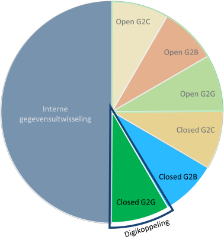

# Context voor ontwikkeling van het Digikoppeling REST API profiel

Het Digikoppeling Rest API profiel is gericht op Machine-to-Machine (M2M) en Government-to-Government (G2G) interacties conform de algemene uitgangspunten van de Digikoppeling standaard en het toepassingsgebied van Digikoppeling op de Pas-toe-of-leg-uit lijst (PTLU) van het Forum Standaardisatie;

Opzet Digikoppeling:

# Toelichting bij de scope van het Digikoppeling REST API profiel

<!--  -->

In de figuur wordt onderscheid gemaakt tussen open en gesloten diensten:

- Open Diensten: Diensten zonder toegangsbeperking bv open data.
- Gesloten Diensten: Diensten met toegangsbeperking bv persoonsgegevens en vertrouwelijke gegevens of diensten voor specifieke partijen.

Het Digikoppeling REST API profiel richt zich op Machine-to-Machine (M2M) gegevensuitwisseling via een gesloten dienst tussen overheidspartijen.
Buiten scope van het profiel zijn:

- REST API's voor open diensten van een overheidspartij.
- REST API's voor gesloten diensten van een overheidspartij (direct) aan burgers of bedrijven.

Het Digikoppeling REST API profiel is wat betreft functionele toepassing vergelijkbaar met het Digikoppeling WUS profiel.
De client van de dienstafnemer die gebruik maakt van het Digikoppeling REST API profiel is in deze context een systeem (applicatie) en geen internetbrowser.

| Invulling Digikoppeling  | DK REST API profiel | DK WUS profiel | DK ebMS2 profiel |
| --- | --- |---|---|
| Bevragingen / Meldingen |  |  |  |
| best-effort | 1.0 | 2W-be | osb-be |
| best-effort signed |  | 2W-be-S | osb-be-s |
| best-effort signed/encrypted |  | 2W-be-SE | osb-be-e |
|  |  |  |  |
| reliable |  |  | osb-rm |
| reliable signed |  |  | osb-rm-s |
| reliable signed en encrypted |  |  | osb-rm-e |

In versie 1.0 van het Digikoppeling REST API profiel wordt signing en encryptie niet ondersteund. In toekomstige versies van het profiel zal hier wel invulling aan worden gegeven. (Zie ook [Bijlage HTTP Signing & Encryptie](https://github.com/centrumvoorstandaarden/DigikoppelingRestfulApiProfiel/blob/master/DK_REST_API_totaal.md#bijlage-gebruik-van-signing--encryptie-in-de-context-van-http--rest-api) )

<!-- [Bijlage HTTP Signing & Encryptie](#Bijlage-gebruik-van-signing--encryptie-in-de-context-van-http--rest-api)  -->

# Digikoppeling Restful API profiel

HTML versie [Digikoppeling Restful API Profiel](https://centrumvoorstandaarden.github.io/DigikoppelingRestfulApiProfiel/)

## Inleiding

### Historie

Vanuit het TO Digikoppeling zijn al langere tijd de ontwikkelingen rond Restful API's gevolgd. Binnen het Kennisplatform API zijn de REST-API Design Rules (REST ADR) ontwikkeld en de REST ADR standaard is ook opgenomen op de Pas-toe-of-leg-uit lijst van het Forum Standaardisatie. De REST ADR standaard is dan ook als basis genomen voor dit Digikoppeling REST API Profiel dat zich specifiek richt op G2G (Government-to-Government) interactie en M2M (Machine-to-Machine verkeer).

### Toepassingsgebied

Het toepassingsgebied is voor Digikoppeling:

> *Digikoppeling moet worden toegepast op alle digitale gegevensuitwisseling met behulp van gestructureerde berichten die plaatsvindt met voorzieningen die onderdeel zijn van de GDI, waaronder de basisregistraties, of die sector-overstijgend is.*

Dit profiel is toe te passen bij het aanbieden van REST API's ten behoeve van het ontsluiten van overheidsinformatie en/of functionaliteit.

## Digikoppeling REST-API profiel

### Algemeen

Het Digikoppeling REST-API profiel is gebaseerd op de REST-API Design Rules standaard zoals ontwikkeld door het Kennisplatform API's en in beheer gebracht bij Logius Stelsels & Standaarden: [[API Design Rules]]

Het Digikoppeling REST-API profiel conformeert zich volledig aan het normatieve deel van de REST-API Design Rules.

### Koppelvlak Generiek

#### Vertrouwelijkheid

De Digikoppeling Beveiligingsstandaarden en voorschriften gaan specifiek in op het verplichte gebruik van PKIO certificaten [[PKI Policy]] en 2-zijdig TLS.
* Zie [[Digikoppeling Beveiligingsdocument]]

#### Identificatie & Authenticatie

Digikoppeling maakt gebruik van het OIN (Organisatie Identificatie Nummer) voor de identificatie van organisaties.
Binnen dit DK REST-API profielprofiel zijn er alleen voorschriften m.b.t. het verplicht gebruik van het OIN binnen PKIO certificaten. Voor OIN gebruik binnen payloads (bv JSON) of resource-pad gelden geen specifieke voorschriften.
* Zie [[Digikoppeling Identificatie-Authenticatie]]

### API Design Rules

#### Toelichting aanduidingen

 Voorschriften zijn aangeduid met 'Verplicht', 'Aanbevolen' en 'Niet van Toepassing' waarvoor de volgende definities gelden:

|**Categorie** | **Codering RFC2119** |**Voorschrift** | **Toelichting** |
| --- | --- |---|---|
|  Verplicht | MUST |De eisen moeten gevolgd worden. Hier kan niet van afgeweken worden.|
|  Aanbevolen | SHOULD | Aanbevolen is om de eisen conform conform voorschrift te implementeren. Wanneer hier van afgeweken wordt dient een zorgvuldige afweging plaats te vinden  |
|  Niet van Toepassing | - | De eisen zijn niet van toepassing|

(Indeling gebaseerd op [[?rfc2119]])

#### Regels

Het Digikoppeling REST-API profiel conformeert zich volledig aan het normatieve deel van de [[API Design Rules]].

 |**Categorie** |**Principe** |**Toelichting** |**Link** |
 |--- | --- |---|---|
 |Verplicht | REST-API Design Rules | Het is verplicht te voldoen aan alle (normatieve) eisen van de REST-API Design Rules |[[API Design Rules]]. |

In onderstaande tabel worden de normatieve eisen van de [[API Design Rules]] weergegeven:

Normatieve eisen van de REST API Design Rules

 |**Categorie** |**Principe** |**Toelichting** |**Link** |
 |--- | --- |---|---|
 |Verplicht |3.1 API-01: Adhere to HTTP safety and idempotency semantics for operations |  |[API-01: Adhere to HTTP safety and idempotency semantics for operations](https://logius-standaarden.github.io/API-Design-Rules/#api-01) |
 |Verplicht |3.3 API-02: Do not maintain state information at the server |  |[API-02: Do not maintain session state on the server](https://logius-standaarden.github.io/API-Design-Rules/#api-02) |
 |Verplicht|3.2 API-03: Only apply default HTTP operations |  |[API-03: Only apply standard HTTP methods](https://logius-standaarden.github.io/API-Design-Rules/#api-03) |
 |Verplicht|3.1 API-04: Define interfaces in Dutch unless there is an official English glossary available |  |[API-04: Define interfaces in Dutch unless there is an official English glossary available](https://logius-standaarden.github.io/API-Design-Rules/#api-04) |
 |Verplicht|3.5 API-05: Use nouns to indicate resources |  |[API-05: Use nouns to name resources](https://logius-standaarden.github.io/API-Design-Rules/#api-05) |
 |Verplicht|3.4 API-06: Use nested resources for child resources |  |[API-06: Use nested URIs for child resources](https://logius-standaarden.github.io/API-Design-Rules/#api-06) |
 |Verplicht|3.5 API-10: Model resource operations as a sub-reresource or dedicated resource |  |[API-10: Model resource operations as a sub-resource or dedicated resource](https://logius-standaarden.github.io/API-Design-Rules/#api-10) |
 |Verplicht |3.6 API-16: Use OpenAPI Specification for documentation |  |[API-16: Use OpenAPI Specification for documentation](https://logius-standaarden.github.io/API-Design-Rules/#api-16) |
 |Verplicht|3.6 API-17: Publish documentation in Dutch unless there is existing documentation in English |  |[API-17: Publish documentation in Dutch unless there is existing documentation in English](https://logius-standaarden.github.io/API-Design-Rules/#api-17) |
 |Verplicht|3.11 API-18: Include a deprecation schedule when publishing API changes |  |[API-18: Include a deprecation schedule when publishing API changes](https://logius-standaarden.github.io/API-Design-Rules/#api-18) |
 |Verplicht |3.12 API-19: Schedule a fixed transition period for a new major API version |  |[API-19: Schedule a fixed transition period for a new major API version](https://logius-standaarden.github.io/API-Design-Rules/#api-19) |
 |Verplicht|3.13 API-20: Include the major version number in the URI |  |[API-20: Include the major version number in the URI](https://logius-standaarden.github.io/API-Design-Rules/#api-20) |
 |Verplicht |3.1 API-48: Leave off trailing slashes from URIs |  |[API-48: Leave off trailing slashes from URIs](https://logius-standaarden.github.io/API-Design-Rules/#api-48) |
 |Verplicht |3.6 API-51: Publish OAS at a standard location in JSON-format | |[API-51: Publish OAS document at a standard location in JSON-format](https://logius-standaarden.github.io/API-Design-Rules/#api-51)
 |Verplicht | 3.1 API-53: Hide irrelevant implementation details | |[API-53: Hide irrelevant implementation details](https://publicatie.centrumvoorstandaarden.nl/api/adr/#api-53)
 |Verplicht | 3.1 API-54: Use plural nouns to name collection resources | | [API-54: Use plural nouns to name collection resources](https://publicatie.centrumvoorstandaarden.nl/api/adr/#api-54)
 |Verplicht | API-55: Publish a changelog for API changes between versions | | [API-55: Publish a changelog for API changes between versions](https://publicatie.centrumvoorstandaarden.nl/api/adr/#api-55)
 |Verplicht | API-56: Adhere to the Semantic Versioning model when releasing API changes | | [API-56: Adhere to the Semantic Versioning model when releasing API changes](https://publicatie.centrumvoorstandaarden.nl/api/adr/#api-56)
 |Verplicht | API-57: Return the full version number in a response header | | [API-57: Return the full version number in a response header](https://publicatie.centrumvoorstandaarden.nl/api/adr/#api-57)

## Afspraken API Design Rules extensies

De ADR extensie onderderdelen van dit profiel zijn gebaseerd op: [[API Design Rules-Extensions]].

Hieronder wordt aangegeven welke regels uit de API Design Rules extensies in dit profiel verplicht zijn of worden aanbevolen.

| **Categorie** | **Principe** | **Extensie** | **Toelichting** | **Link** |
| --- | --- | --- | --- | --- |
| Niet van toepassing | 17.1 API-11: Encrypt connections using at least TLS v1.3 | Security | Vervangen door Digikoppeling beveiligingsvoorschriften (*)  |[[Digikoppeling Beveiligingsdocument]] |
| Verplicht | 17.3 API-13: Accept tokens as HTTP headers only | Security Authorisation | | [17.3 API-13: Accept tokens as HTTP headers only](https://docs.geostandaarden.nl/api/API-Strategie-ext/#api-13-accept-tokens-as-http-headers-only) |
| Verplicht | 17.5 API-15: Use PKIoverheid certificates for access-restricted or purpose-limited API authentication | Security Authorisation | | [17.5 API-15: Use PKIoverheid certificates for access-restricted or purpose-limited API authentication](https://docs.geostandaarden.nl/api/API-Strategie-ext/#api-15-use-pkioverheid-certificates-for-access-restricted-or-purpose-limited-api-authentication) |
| Aanbevolen | 17.31 API-46: Use default error handling | Error handling | | [17.31 API-46: Use default error handling](https://docs.geostandaarden.nl/api/API-Strategie-ext/#api-46-use-default-error-handling) |
| Aanbevolen | 17.32 API-47: Use the required HTTP status codes | Error handling  | | [17.32 API-47: Use the required HTTP status codes](https://docs.geostandaarden.nl/api/API-Strategie-ext/#api-47-use-the-required-http-status-codes) |

(*) Wat betreft TLS zijn de Digikoppeling beveiligingsvoorschriften leidend , Zie [[Digikoppeling Beveiligingsdocument]]

# BIJLAGE Gebruik van Signing & Encryptie in de context van HTTP / Rest API

<aside class="note">Deze bijlage is informatief en geen normatief onderdeel van het profiel</aside>

## Signing in de context van HTTP Rest

Signing van HTTP body en/of header kan gebruikt worden voor _authenticatie_, om de _integriteit_ van de request/response berichten te controleren en signing realiseert ook _onweerlegbaarheid_.
(Onweerlegbaarheid in de zin van: de verzender van de request/response kan niet ontkennen het bericht verzonden te hebben wanneer deze voorzien is van de digitale handtekening van de afzender).

De berichten kunnen ook samen met de digitale handtekeningen worden bewaard zodat deze bij audits of juridische bewijsvoering gebruikt kunnen worden.

Een HTTP requestbericht is opgebouwd uit de volgende onderdelen:

- Header
  - HTTP operatie (GET, POST etc)
  - Pad / URL resource
  - Protocol
  - Header velden
- Body
  - _data_

Door naast de body data ook onderdelen uit de header digitaal te ondertekenen kan worden gecontroleerd dat bv ook de HTTP operatie en resource specificatie in de request echt van de afzender afkomstig zijn en niet onderweg gemanipuleerd.

Enkele voorbeelden van signing standaarden die in ontwikkeling zijn:

- https://tools.ietf.org/html/draft-cavage-http-signatures-12
- https://tools.ietf.org/html/draft-ietf-httpbis-message-signatures-01
- https://www.openbankingeurope.eu/media/1735/preta-obe-jws-stable-draft.pdf

## Encryptie in de context van HTTP Rest

Voor encryptie is de standaard JSON Web Encryption (JWE) [[rfc7516]] beschikbaar

Zie ook de ADR extensie signing en encryptie:

- https://docs.geostandaarden.nl/api/API-Strategie-ext/#signing-and-encryption
