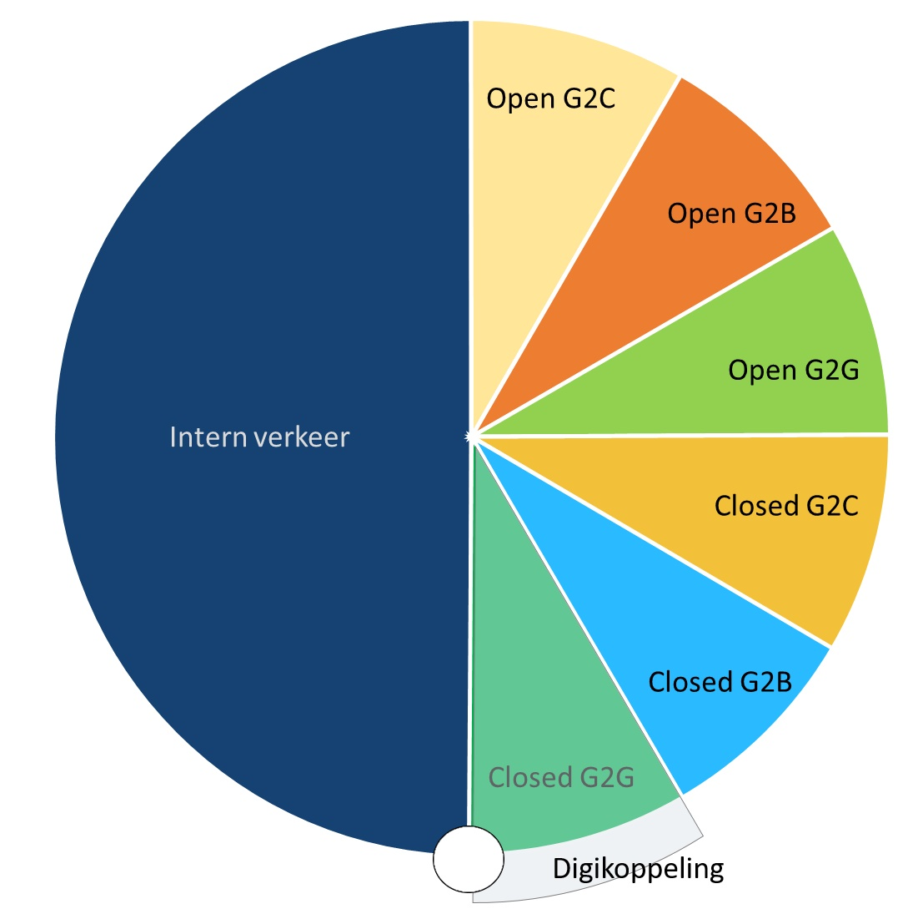

# Toelichting bij de scope van het Digikoppeling REST API profiel

<!--  -->

In de figuur wordt onderscheid gemaakt tussen open en gesloten diensten:

- Open Diensten: Diensten zonder toegangsbeperking bv open data.
- Gesloten Diensten: Diensten met toegangsbeperking bv persoonsgegevens en vertrouwelijke gegevens of diensten voor specifieke partijen.

Het Digikoppeling REST API profiel richt zich op Machine-to-Machine (M2M) gegevensuitwisseling via een gesloten dienst tussen overheidspartijen.
Buiten scope van het profiel zijn:

- REST API's voor open diensten van een overheidspartij.
- REST API's voor gesloten diensten van een overheidspartij (direct) aan burgers of bedrijven.

Het Digikoppeling REST API profiel is wat betreft functionele toepassing vergelijkbaar met het Digikoppeling WUS profiel.
De client van de dienstafnemer die gebruik maakt van het Digikoppeling REST API profiel is in deze context een systeem (applicatie) en geen internetbrowser.

| Invulling Digikoppeling  | DK REST API profiel | DK WUS profiel | DK ebMS2 profiel |
| --- | --- |---|---|
| Bevragingen / Meldingen |  |  |  |
| best-effort | 1.0 | 2W-be | osb-be |
| best-effort signed |  | 2W-be-S | osb-be-s |
| best-effort signed/encrypted |  | 2W-be-SE | osb-be-e |
|  |  |  |  |
| reliable |  |  | osb-rm |
| reliable signed |  |  | osb-rm-s |
| reliable signed en encrypted |  |  | osb-rm-e |

In versie 1.0 van het Digikoppeling REST API profiel wordt signing en encryptie niet ondersteund. In toekomstige versies van het profiel zal hier wel invulling aan worden gegeven. (Zie ook [[[#bijlage-gebruik-van-signing-encryptie-in-de-context-van-http-rest-api]]])

<!-- [Bijlage HTTP Signing & Encryptie](#Bijlage-gebruik-van-signing--encryptie-in-de-context-van-http--rest-api)  -->

